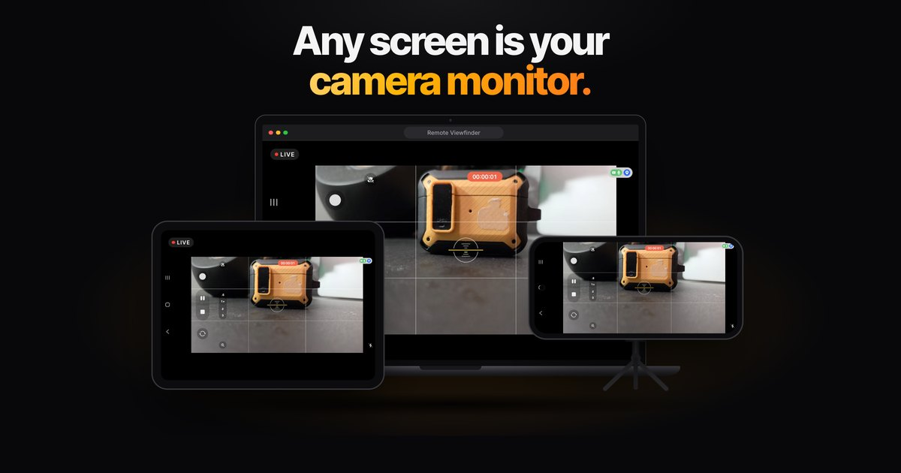

# Remote Viewfinder

**Any screen is your camera monitor.** Film yourself with your Android phone and watch the
shot live on your iPad, laptop or any browser on your Wi-Fi. Tap the picture to hit record.

### [⬇️ Download for Android](https://github.com/js-commit/remote-viewfinder/releases/latest) · [Website](https://js-commit.github.io/remote-viewfinder/)

  

## Why it's different

- **Your camera app, untouched.** Samsung Camera, Google Camera, Pro Video. It mirrors the
  real app, so you keep the phone's processing, stabilization, lenses and modes.
- **Any Wear OS watch.** Not only Galaxy or Pixel. The watch shutter works like a Bluetooth
  selfie-stick remote.
- **Any screen on your Wi-Fi.** iPad, laptop or spare phone: open a link, no app needed.
  Tap the picture to tap the phone.
- **Stays on your network.** No account, no cloud, no analytics.

## Install

| File | For |
|---|---|
| `remote-viewfinder-phone.apk` | Your Android phone (Android 11+). All you need for the browser viewer. |
| `remote-viewfinder-watch.apk` | Your Wear OS watch (Wear OS 3+), for the wrist viewfinder. Sideload with `adb install`. |

Phone and watch apps must come from the same release. Step-by-step setup is on the
[website](https://js-commit.github.io/remote-viewfinder/#install).

## Problems or ideas?

[Open an issue](https://github.com/js-commit/remote-viewfinder/issues).
